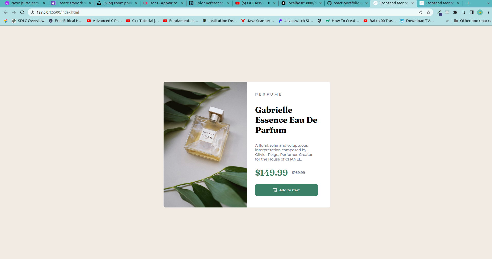
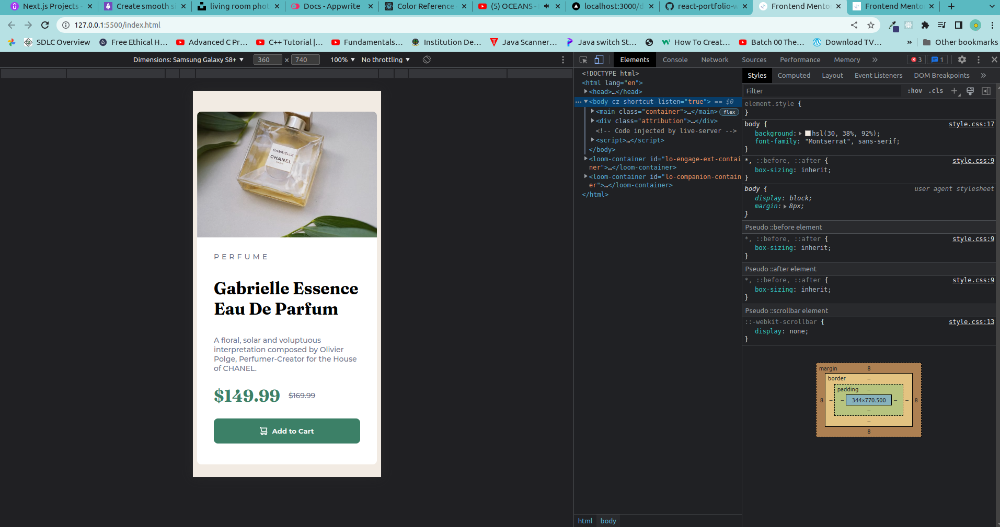

# Frontend Mentor - Product preview card component solution

This is a solution to the [Product preview card component challenge on Frontend Mentor](https://www.frontendmentor.io/challenges/product-preview-card-component-GO7UmttRfa). Frontend Mentor challenges help you improve your coding skills by building realistic projects.

## Table of contents

- [Overview](#overview)
  - [The challenge](#the-challenge)
  - [Screenshot](#screenshot)
  - [Links](#links)
- [My process](#my-process)
  - [Built with](#built-with)
  - [What I learned](#what-i-learned)
- [Author](#author)

## Overview

### The challenge

Users should be able to:

- View the optimal layout depending on their device's screen size
- See hover and focus states for interactive elements

### Screenshot

### Links

- Solution URL: [Add solution URL here](https://your-solution-url.com)
- Live Site URL: [Add live site URL here](https://your-live-site-url.com)

## My process

### Built with

- Semantic HTML5 markup
- CSS custom properties
- Flexbox

### What I learned

In this exercise, I have been able to put in practice some of the things I've learnt about CSS. This include first putting the structure of the page in place before doing anything else, for instance, Global border-box fix and the Lobotomized owl global margins. I used the double container pattern common for centering content on a page. Finally I used the content property to set the image while on small screen device.

## Author

- Website - [Amakoye Charles](https://github.com/Amakoye)
- Frontend Mentor - [@Amakoye](https://www.frontendmentor.io/profile/Amakoye)
- Twitter - [@charlesamakoye](https://www.twitter.com/charlesamakoye)
